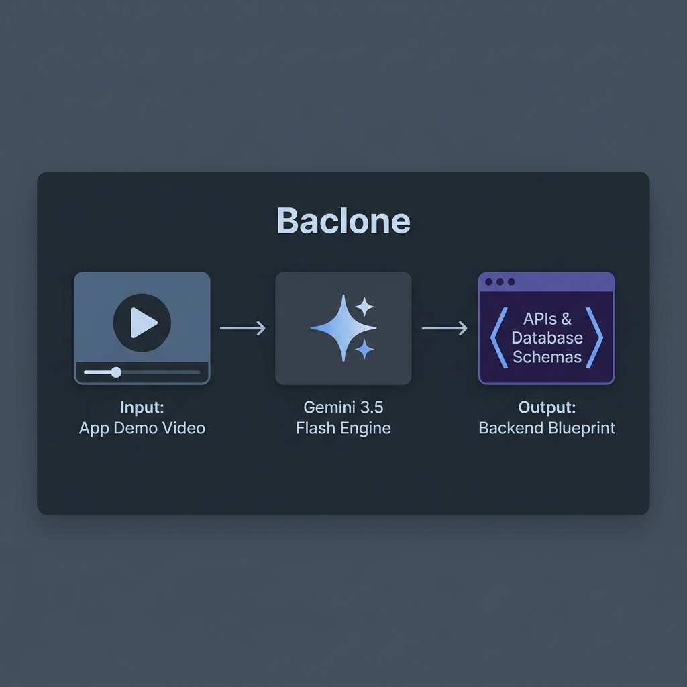
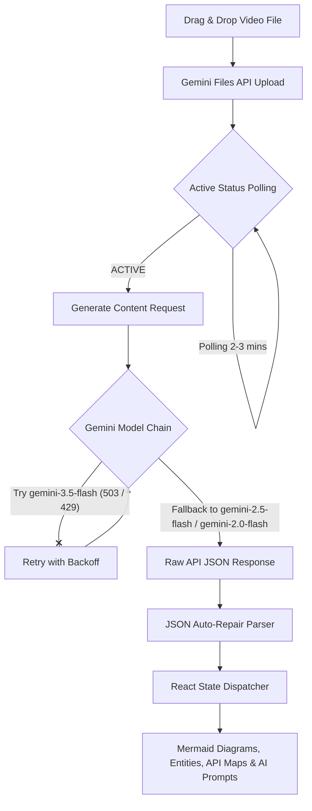
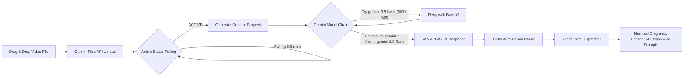

# 🔍 Baclone (Video-to-Backend Reverse Engineer)



Baclone is an AI-powered software architect system that accepts a screen recording of any web or mobile application, analyzes its screens, database models, and API interfaces, and reverse-engineers its complete backend architecture. 

It is designed to translate visual cues, dynamic UI changes, and user interaction loops into developer-ready architectural blueprints, database schemas, and system integration diagrams.

---

## 📺 Demo & Video Walkthrough

[](https://youtu.be/DXtH4nCFIeE)
*Click the preview above to watch the application demo and walkthrough on YouTube.*

---

## 📸 Screenshots & UI Preview

### Main Dashboard & Video Uploader


*The dashboard features a high-fidelity glassmorphic dark-mode interface with file drag-and-drop, real-time Gemini processing indicators, and dynamic UML diagrams.*

---

## 🚀 Key Features

*   **🎬 Multimodal Video Analysis**: Directly uploads `.mp4` or `.mov` recordings. Uses the **Google Gemini Files API** to process, transcode, and examine video frames semantically.
*   **💾 Database Entity Extraction**: Infers database entities, attributes, and relationships (1:1, 1:N, N:M) based on UI states and interaction patterns.
*   **🛣️ RESTful API Endpoint Mapping**: Automatically generates endpoints (`GET`, `POST`, `PUT`, `DELETE`, `PATCH`) with descriptions, path parameters, and request/response shapes.
*   **📊 Dynamic Mermaid UML Rendering**: Produces live-rendering UML Class and Sequence diagrams using `Mermaid.js` directly within the browser interface.
*   **🦾 AI Coding Agent Ready Prompts**: Compiles a full-context system prompt detailing the tech stack, database entities, modules, and API rules, ready to be copied into Cursor, Claude, or other coding agents to generate a functional backend in seconds.
*   **⏳ Resilient Processing Pipeline**: Features a robust, multi-model fallback chain and a self-repairing JSON parser to mitigate token limit truncations.

---

## 🛠️ Architecture & System Design

Baclone operates as a client-side reactive application that interacts directly with the Google Gemini API using a secure, multi-stage pipeline.

### 📊 System Workflow Diagrams

#### Vertical Flow (TD)


#### Horizontal Flow (LR)


### 🧠 The Core Technical Specs

1.  **Google Gemini Files API Integration**:
    *   Large video files are transcoded on Google's infrastructure. Baclone uses the **Resumable Upload Protocol** (`/upload/v1beta/files`) to perform chunked uploads.
    *   A polling mechanism checks the file state every 2 seconds for up to 3 minutes.
2.  **Robust Model Fallback Chain**:
    *   To guarantee uptime under high traffic or rate limits, the system tries models sequentially:
        $$\text{gemini-3.5-flash} \longrightarrow \text{gemini-2.5-flash} \longrightarrow \text{gemini-2.0-flash} \longrightarrow \text{gemini-2.0-flash-001}$$
    *   If a request encounters a `503` (Service Unavailable) or a `429` (Rate Limit), the system executes an exponential backoff retry (up to 3 retries, delaying 5s, 10s, and 15s) before cascading to the next model in the chain.
3.  **Truncated JSON Auto-Repair Algorithm**:
    *   When processing large videos, responses may occasionally be cut off due to token limit caps.
    *   Baclone passes the raw text through a bracket-balancing parser (`repairJSON`) that counts unmatched braces `{` and brackets `[` while ignoring quoted strings, then appends the missing close-tokens to recover a valid JSON structure.

---

## 🗂️ Project Directory Structure

```
baclone/
├── appvision/               # Main Frontend React Application
│   ├── src/
│   │   ├── components/      # UI components (Result panels, loaders, video upload)
│   │   │   ├── AnalysisSteps.jsx    # Visual pipeline steps tracker
│   │   │   ├── MermaidDiagram.jsx   # Live Mermaid.js visual renderer
│   │   │   ├── ResultPanel.jsx      # Core tabbed architecture output viewer
│   │   │   └── VideoUploader.jsx    # Drag-and-drop file interface
│   │   ├── services/        # Gemini API integration & fallback logic
│   │   │   ├── api.js               # Unified API controller (routes Real vs. Mock)
│   │   │   └── gemini.js            # Direct Generative AI interaction logic
│   │   ├── data/            # Local datasets
│   │   │   └── mockAnalysis.js      # Mock payload for offline development
│   │   └── pages/           # Application views
│   │       └── Home.jsx             # Main dashboard coordinator
│   ├── public/              # Static assets & assets
│   ├── package.json         # Frontend configuration
│   └── vite.config.js       # Vite configuration with Tailwind CSS v4 support
├── setup.bat                # Automated installation and configuration script (Windows)
├── setup.sh                 # Automated installation and configuration script (macOS/Linux)
├── AGENT.md                 # Technical onboarding guide for AI development agents
└── TODO.md                  # Development roadmap and future backlog
```

---

## ⚙️ Getting Started

### 📋 Prerequisites

*   **Node.js**: Version 18.0 or higher.
*   **Gemini API Key**: Obtain a key from [Google AI Studio](https://aistudio.google.com/).

### 🛠️ Automated Setup (Recommended)

Run the setup script corresponding to your operating system in the root directory:

*   **Windows**:
    ```cmd
    setup.bat
    ```
*   **macOS / Linux**:
    ```bash
    chmod +x setup.sh
    ./setup.sh
    ```

The wizard will:
1. Validate that Node.js is installed.
2. Prompt you for your `VITE_GEMINI_API_KEY` (press Enter to run in **Mock Mode** using pre-configured mock payloads).
3. Automatically generate the appropriate `.env` files.
4. Run `npm install` inside the `appvision` directory.

### 🏃 Manual Setup

If you prefer to configure the project manually:

1.  Create a `.env` file in the `appvision/` directory:
    ```env
    VITE_GEMINI_API_KEY=your_actual_gemini_api_key_here
    ```
2.  Navigate to the `appvision` directory:
    ```bash
    cd appvision
    ```
3.  Install dependencies:
    ```bash
    npm install
    ```
4.  Run the development server:
    ```bash
    npm run dev
    ```
5.  Open `http://localhost:5173` in your browser.

---

## 🔒 Security & Privacy

*   **Client-Side Execution**: All analysis runs directly in the client browser. Your Gemini API key is stored locally in your environment variables and never sent to any third-party server besides Google's official Gemini endpoint.
*   **Video Cleanup**: Uploaded video files are automatically deleted from Google Generative Language servers using the `DELETE` file endpoint immediately after the analysis is parsed.

---

## 📄 License

This project is open-source and licensed under the [MIT License](LICENSE).
