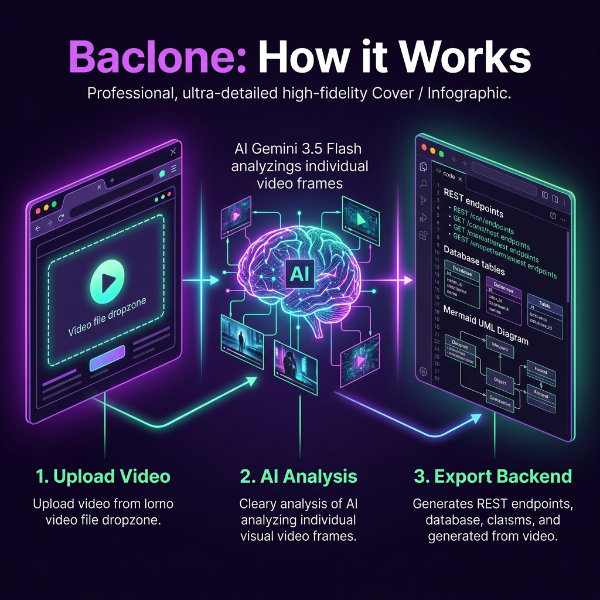

# 🔍 baclone (Video-to-Backend Reverse Engineer)


Baclone is an AI-powered system architect that accepts a screen recording of any application and reverse-engineers its complete backend architecture. Using the state-of-the-art **Gemini 3.5 Flash** model via the Google Gemini API, it analyzes visual cues, user interactions, and screens to output a complete backend design blueprint.

---

## 📺 Demo & Video Walkthrough

[Watch the Baclone Demo Video on YouTube](https://www.youtube.com/watch?v=YOUR_YOUTUBE_VIDEO_ID)
*Click the link above to watch the application demo and walkthrough on YouTube.*

---

## 📸 Screenshots & UI Preview

### Main Dashboard & Video Uploader


*The dashboard features a high-fidelity glassmorphic dark-mode interface with file drag-and-drop, real-time Gemini processing indicators, and dynamic UML diagrams.*

---

## ✨ Features

- **Multimodal Video Processing**: Upload `.mp4` or `.mov` files directly. The app utilizes the Gemini Files API to upload and analyze your screen recording frames.
- **Database Entity Extraction**: Infers database entities, data models, and fields based on app behaviors.
- **Endpoint Design**: Suggests realistic RESTful API endpoints (`GET`, `POST`, `PUT`, `DELETE`, `PATCH`) with descriptions.
- **Mermaid UML Generation**: Automatically generates and renders complete UML Class diagrams and Sequence diagrams using Mermaid.js.
- **AI-Agent Ready Prompts**: Compiles a production-ready system prompt containing the stack, database, module list, and formatting rules, ready to be pasted directly into Cursor, Claude, or other coding agents.
- **Resilient Fallback Chain**: Implements a robust model-fallback chain (`gemini-3.5-flash` ➜ `gemini-2.5-flash` ➜ `gemini-2.0-flash`) and handles rate limits/timeouts (up to 3-minute video processing limits).

---

## ⚙️ How it Works



1. **Upload Video**: Drag and drop or browse to upload a screen recording of your web or mobile application.
2. **AI Multimodal Analysis**: Baclone uploads the video via the Gemini Files API and uses `gemini-3.5-flash` to extract UI frames, user interaction sequences, and structure.
3. **Generate & Export**: Automatically renders Mermaid UML class and sequence diagrams, database structures, and ready-to-run prompts for code generation.

---

## 🛠️ Tech Stack

- **Frontend Core**: React 19, Vite, Tailwind CSS v4
- **Animation & Transitions**: GSAP (GreenSock), Framer Motion
- **Diagrams**: Mermaid.js
- **Icons**: Lucide React
- **AI Integration**: Google Generative AI SDK (`@google/generative-ai`)

---

## 🚀 Getting Started

### Prerequisites

- Node.js (v18 or higher)
- A Google Gemini API Key. You can get one from [Google AI Studio](https://aistudio.google.com/).

### Installation & Run

1. Clone this repository.
2. In the root directory, create a `.env` file and add your Gemini API key:
   ```env
   VITE_GEMINI_API_KEY=your_gemini_api_key_here
   ```
3. Copy or create the same `.env` file in the `appvision` directory.
4. Navigate into the `appvision` folder:
   ```bash
   cd appvision
   ```
5. Install dependencies:
   ```bash
   npm install
   ```
6. Start the local development server:
   ```bash
   npm run dev
   ```
7. Open `http://localhost:5173` in your browser.

*Note: If no API key is specified, the application automatically runs in **Mock Mode**, simulating a full video analysis using pre-defined mock data.*

---

## 🗂️ Project Structure

```
baclone/
├── appvision/               # Main React application
│   ├── src/
│   │   ├── components/      # UI components (Result panels, loaders, video upload)
│   │   ├── services/        # Gemini API integration & fallback logic
│   │   ├── data/            # Mock dataset
│   │   └── pages/           # Home & Dashboard pages
│   ├── public/              # Static assets & icons
│   └── package.json
└── package.json             # Root dependencies
```
